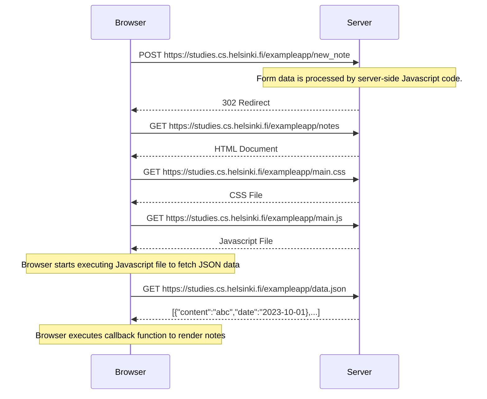

```mermaid
sequenceDiagram
Browser->>Server: POST https://studies.cs.helsinki.fi/exampleapp/new_note
Note over Server: Form data is processed by server-side Javascript code.
Server-->>Browser: 302 Redirect
Browser->>Server: GET https://studies.cs.helsinki.fi/exampleapp/notes
Server-->>Browser: HTML Document
Browser->>Server: GET https://studies.cs.helsinki.fi/exampleapp/main.css
Server-->>Browser: CSS File
Browser->>Server: GET https://studies.cs.helsinki.fi/exampleapp/main.js
Server-->>Browser: Javascript File
Note over Browser: Browser starts executing Javascript file to fetch JSON data
Browser->>Server: GET https://studies.cs.helsinki.fi/exampleapp/data.json
Server-->>Browser: [{"content":"abc","date":"2023-10-01},...]
Note over Browser: Browser executes callback function to render notes
```
