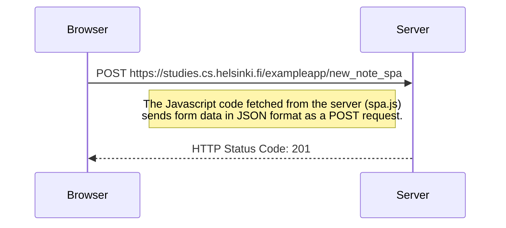

```mermaid
sequenceDiagram
Browser->>Server: POST https://studies.cs.helsinki.fi/exampleapp/new_note_spa
Note left of Server: The Javascript code fetched from the server (spa.js)<br />sends form data in JSON format as a POST request.

Server-->>Browser: HTTP Status Code: 201
```
